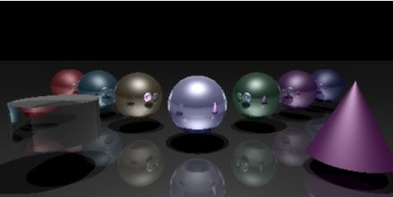

# Raytracing 
(In progress)

Simple ray tracer program using X11 library for display

Platform: Linux (tested on Ubuntu)

- Use `make` to compile (may need to install xorg-dev: `sudo apt install xorg-dev`
- Use `./Main test_input.txt` to run
- When running, use `↑↓←→` keys to rotate the camera around; press `f`/`b` to move camera away from or closer to origin

Note: 
1. Most of the constants are in Model.h
2. Currently implemented object types: plane, sphere, cylinder and cone

Input file format:
	
	window_height aspect_ratio
	light_source_position(x y z) light_source_color(r g b) light_source_intensity
	infinite_light_source_position(x y z) infinite_light_source_color(r g b) light_source_intensity
	camera_position
	gazing_vector
	near_plane far_plane viewing_angle
	camera_up_vector(default is [0 0 1])
	number_of_objects
	
	object1_type_id
	object1_color(r g b)
	ambient_coefficient diffuse_coefficient specular_coefficient fallout_exponent reflection_coefficient
	transformation_matrix (4 rows by 4 columns)

